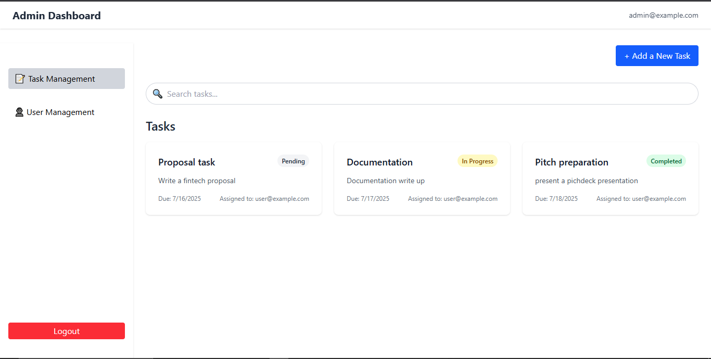

# Cytonn Task Manager

A task management system built as part of the **Cytonn 2025 Software Engineering Internship Challenge**. It allows admins to manage users and tasks, while users can view and update their assigned tasks.

---

## 🌐 Live Demo

🔗 [https://cytonntaskmanager.vercel.app/](https://cytonntaskmanager.vercel.app/)



> You can test using either of these accounts:

### 🔑 Admin Demo Credentials:

- **Email:** `admin@example.com`
- **Password:** `admin123`

### 👤 User Demo Credentials:

- **Email:** `user@example.com`
- **Password:** `user123`

---

## 🛠 Tech Stack

### Backend:

- Node.js
- Express.js
- MongoDB
- Nodemailer (for email notifications)
- JWT-based authentication

### Frontend:

- React.js
- Tailwind CSS
- Vite
- TypeScript

---

## 📦 Features

### Admin:

- Add, edit, and delete users
- Assign tasks to users
- Set deadlines
- View and manage all tasks

### Users:

- View assigned tasks
- Update task status (Pending / In Progress / Completed)
- Receive email notifications on new task assignments

---

## 🗃 Database

- MongoDB was used as the database.
- A `mongodump` archive is included:  
  **`cytonn-task-manager-dump.archive`**

To restore:

```bash
mongorestore --archive=cytonn-task-manager-dump.archive
```

## 🚀 Running Locally

### 🖥️ Backend

```bash
cd server
cp .env.example .env
# Fill in your Mongo URI and JWT_SECRET in .env

npm install
npm run dev to watch || npm start for prod
```

### 🔐 Environment Variables for server

Create a `.env` file in the `server/` directory using the provided `.env.example`. Here's what it contains:

```env
MONGO_URI=your_mongo_connection_string
JWT_SECRET=your_jwt_secret
PORT=5000

EMAIL_USER=youremail@example.com
EMAIL_PASS=your_email_password
EMAIL_HOST=smtp.example.com
EMAIL_PORT=587
```

### Frontend

```bash
cd client
npm install
npm run dev

```

### Folder structure

```bash
cytonn-task-manager/
├── client/                            # React frontend
├── server/                            # Node.js backend
├── cytonn-task-manager-dump.archive  # MongoDB dump archive
├── README.md

```

## 🔐 Environment Variables for client

Create a `.env.local` file in the `client/` directory using the provided `.env.example`. Here's what it contains:

```env
 VITE_BASE_URL=http://localhost:5000/api/v1

```
